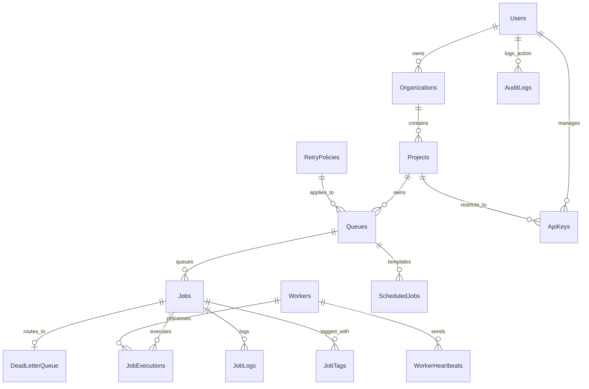

# Entity Relationship (ER) Diagram & Schema Design

This document details the database schema, entity relations, data types, indexes, and normalization strategies implemented in the Distributed Job Scheduler.

---

## 1. ER Diagram (Mermaid)

---

## 2. Table Specifications

### Users
* `id` (TEXT, UUID): Primary Key.
* `name` (TEXT): Full name.
* `email` (TEXT): Unique, indexed, used for login.
* `password_hash` (TEXT): Hashed user password (bcrypt).
* `role` (TEXT): 'ADMIN' or 'USER'.
* `created_at` (DATETIME): Default timestamp.

### Organizations
* `id` (TEXT, UUID): Primary Key.
* `name` (TEXT): Organization name.
* `owner_id` (TEXT): Foreign Key referencing `Users(id)` on `ON DELETE RESTRICT` (prevents deleting active users holding active orgs).

### Projects
* `id` (TEXT, UUID): Primary Key.
* `organization_id` (TEXT): Foreign Key referencing `Organizations(id)` on `ON DELETE CASCADE` (deletes all projects if an organization is deleted).
* `name` (TEXT): Project name.
* `description` (TEXT): Project description.

### RetryPolicies
* `id` (TEXT, UUID): Primary Key.
* `name` (TEXT): Strategy label.
* `type` (TEXT): FIXED, LINEAR, or EXPONENTIAL.
* `delay_ms` (INTEGER): Base backoff delay.
* `multiplier` (REAL): Factor for exponential rate.
* `max_retries` (INTEGER): Attempt limit.

### Queues
* `id` (TEXT, UUID): Primary Key.
* `project_id` (TEXT): Foreign Key referencing `Projects(id)` on `ON DELETE CASCADE`.
* `name` (TEXT): Queue name. Unique per project via composite index `UNIQUE(project_id, name)`.
* `priority` (INTEGER): Priority weight (1 = LOW, 2 = MEDIUM, 3 = HIGH).
* `concurrency_limit` (INTEGER): Max active workers.
* `retry_policy_id` (TEXT): Foreign Key referencing `RetryPolicies(id)` on `ON DELETE SET NULL`.
* `paused` (INTEGER): Boolean flag (0 = Active, 1 = Paused).
* `rate_limit_per_minute` (INTEGER): Token bucket rate limit.
* `webhook_url` (TEXT): Optional alerts integration webhook.
* `shard_count` (INTEGER): Number of consistent hashing shards (defaults to 1).
* `region` (TEXT): Geographic deployment region for partitioning.

### Workers
* `id` (TEXT, UUID): Primary Key.
* `hostname` (TEXT): Name of machine.
* `status` (TEXT): ACTIVE, IDLE, or OFFLINE.
* `registered_at` (DATETIME).
* `last_heartbeat` (DATETIME): Indexed for offline checking.

### Jobs
* `id` (TEXT, UUID): Primary Key.
* `queue_id` (TEXT): Foreign Key referencing `Queues(id)` on `ON DELETE CASCADE`.
* `status` (TEXT): QUEUED, SCHEDULED, CLAIMED, RUNNING, COMPLETED, FAILED, DEAD, BLOCKED, or CANCELLED.
* `priority` (INTEGER): Execution priority (higher runs first).
* `payload` (TEXT): JSON string containing parameters.
* `scheduled_for` (DATETIME): Time when job becomes eligible for execution.
* `worker_id` (TEXT): Foreign Key referencing `Workers(id)` on `ON DELETE SET NULL`.
* `retry_count` (INTEGER): Current attempt index.
* `max_retries` (INTEGER): Max attempts before DLQ.
* `timeout_ms` (INTEGER): Execution timeout.
* `idempotency_key` (TEXT): Uniqueness key per queue.
* `dependency_job_id` (TEXT): Self-referential ID for DAG parent-child dependencies.
* `tags` (TEXT): Comma-separated search tags.
* `version` (INTEGER): Concurrency version identifier (defaults to 1).
* `correlation_id` (TEXT): Core trace correlation ID.
* `payload_history` (TEXT): Historical payload modifications during retries.

### JobExecutions
* `id` (TEXT, UUID): Primary Key.
* `job_id` (TEXT): Foreign Key referencing `Jobs(id)` on `ON DELETE CASCADE`.
* `worker_id` (TEXT): Foreign Key referencing `Workers(id)` on `ON DELETE SET NULL`.
* `start_time` (DATETIME): Execution start.
* `end_time` (DATETIME): Execution end.
* `duration_ms` (INTEGER): Active execution run time.
* `status` (TEXT): SUCCESS or FAILED.
* `error_message` (TEXT).

### DeadLetterQueue (DLQ)
* `id` (TEXT, UUID): Primary Key.
* `job_id` (TEXT): Foreign Key referencing `Jobs(id)` on `ON DELETE CASCADE`. Unique constraint.
* `reason` (TEXT): Error message causing permanent failure.
* `failed_at` (DATETIME).
* `resolved` (INTEGER): Boolean flag (0 = Active, 1 = Resolved).

### AuditLogs
* `id` (TEXT, UUID): Primary Key.
* `user_id` (TEXT): User who performed the action.
* `action` (TEXT): The action performed (e.g. CREATE_JOB, REVOKE_API_KEY).
* `entity_type` (TEXT): Affected table name.
* `entity_id` (TEXT): Primary Key of the affected row.
* `old_value` (TEXT): Serialized state before the action.
* `new_value` (TEXT): Serialized state after the action.
* `ip_address` (TEXT): Request source IP.
* `user_agent` (TEXT): Client user agent.
* `created_at` (DATETIME): Defaults to current timestamp.

### ApiKeys
* `id` (TEXT, UUID): Primary Key.
* `user_id` (TEXT): Foreign Key referencing `Users(id)` on `ON DELETE CASCADE`.
* `project_id` (TEXT): Foreign Key referencing `Projects(id)` on `ON DELETE CASCADE`.
* `key_hash` (TEXT): SHA-256 hashed api key. Unique key constraint.
* `name` (TEXT): Display name / description.
* `permissions` (TEXT): Scoped API permissions.
* `rate_limit` (INTEGER): Key rate limit quota (default 100).
* `expires_at` (DATETIME).
* `created_at` (DATETIME).

### JobTags
* `id` (TEXT, UUID): Primary Key.
* `job_id` (TEXT): Foreign Key referencing `Jobs(id)` on `ON DELETE CASCADE`.
* `tag` (TEXT): The tag string (indexed for search).

---

## 3. Database Normalization (3NF)
* **First Normal Form (1NF)**: All column values are atomic (e.g. primitive types). Payload variables are serialized into a single JSON TEXT string rather than multi-valued fields.
* **Second Normal Form (2NF)**: All non-key attributes are fully dependent on their respective primary keys. For example, retry policies are decoupled into `RetryPolicies` rather than duplicate strategy fields inside `Queues` or `Jobs`.
* **Third Normal Form (3NF)**: Transitive functional dependencies are eliminated. For instance, jobs reference `Queues(id)` but do not store project or organization names, which are looked up via SQL Joins on `Queues -> Projects -> Organizations`.

---

## 4. Key Performance Indexes
1. **Job Selector Index (`idx_jobs_selection`)**:
   `CREATE INDEX idx_jobs_selection ON Jobs(status, scheduled_for, priority DESC, created_at ASC);`
   * **Why**: The scheduler and worker poll query filters on status (`status = 'QUEUED'`), time (`scheduled_for <= ?`), and orders by priority desc, created_at asc. This composite index matches the WHERE/ORDER clauses perfectly, returning the highest priority claimable job in `O(log N)` complexity.
2. **Idempotency Key Index (`idx_jobs_idempotency`)**:
   `CREATE UNIQUE INDEX idx_jobs_idempotency ON Jobs(queue_id, idempotency_key) WHERE idempotency_key IS NOT NULL;`
   * **Why**: Enforces unique key constraint across a queue. The partial index (`WHERE ... IS NOT NULL`) keeps index sizes small.
3. **Logs Query Index (`idx_job_logs_job_id`)**:
   `CREATE INDEX idx_job_logs_job_id ON JobLogs(job_id, timestamp);`
   * **Why**: Speeds up fetching logs for individual jobs on the inspector modal.
